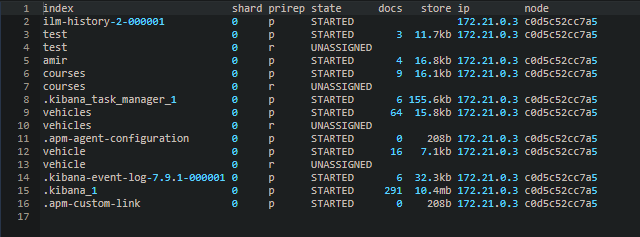

<p>GET all indices</p>

```http
GET /_cat/indices
```

<p>GET cluster health</p>

```http
GET /_cluster/health
```

<p>GET shards</p>

```http
GET /_cat/shards
```




>this image is output of the above uri and under orirep column p is primary shard and r is reolica.<br>
>status unassigned meaning is that we don,t have another node in this cluster to put the replica in it.  

___

